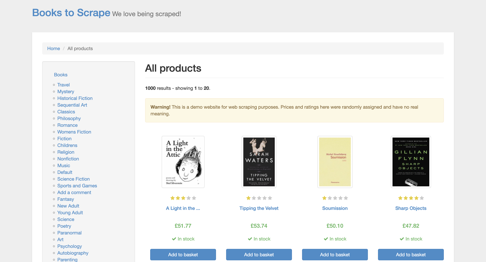
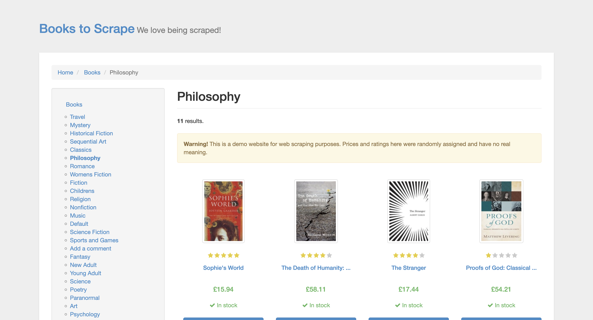
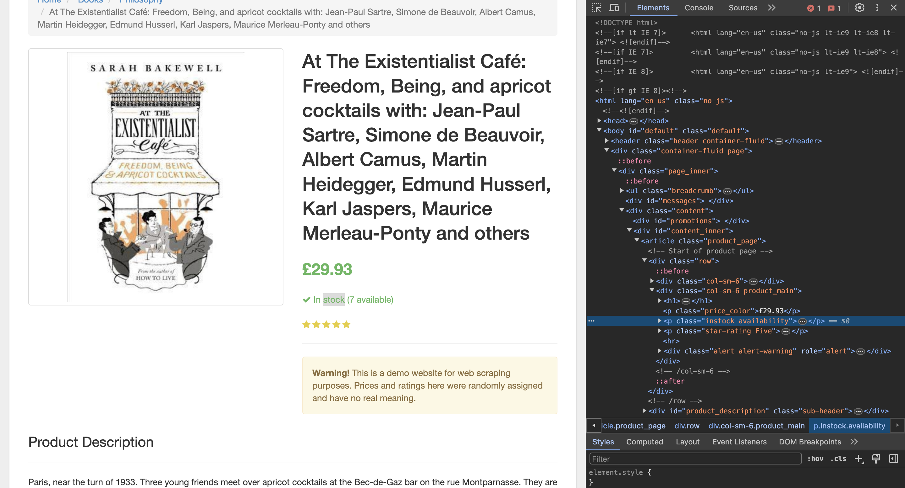

## Project : Use Python basics for market analysis

[**Français**](README-fr.md)

  
  
  

### Table of contents :
1. Project description.
2. Compatible configurations.
3. Installing the program.
4. Features.
5. Running the program.

## 1. Project description :

This project was carried out as part of the Python Developer training offered by OpenClassrooms. 
The main topic being data management using the ETL (extract-transform-load) process, the objective
of this project is to create a program (a scraper) developed in Python, capable of extracting a
number of data (price, category, etc.) from an online library 
[Books to Scrape](https://books.toscrape.com/).
The extracted information will be used notably for marketing analysis.

## 2. Compatible configurations :

* Python 3.10.7
* Windows 10
* Mac
* Linux

## 3. Installing the program :
This program uses the following Python libraries :

beautifulsoup4 4.11.1\
bs4 0.0.1\
certifi 2022.9.24\
charset-normalizer 2.1.1\
html5lib 1.1\
idna 3.4\
lxml 4.9.1\
python-slugify 6.1.2\
requests 2.28.1
six 1.16.0\
soupsieve 2.3.2.post1\
text-unidecode 1.3\
urllib3 1.26.12\
webencodings 0.5.1

## 4. Features :

* <u> Feature 1</u> : Scrape the page of a <b>book</b> with **scrap_book(url)** function.
   Here url is the url of a book.
* <u> Feature 2</u> : Scrape the page of a <b>category</b> with **scrap_category(url)** function.
  Here url is the url of a category.
* <u> Feature 3</u> : Scrape <b>the whole website</b> with **etl_categories(url)** function. Here
  url is the site url <a>https://books.toscrape.com/</a>.

## 5. Running the program :

1. Open a terminal (e.g., Cygwin for Windows, the Terminal for Mac) or in an IDE (e.g., PyCharm).
2. Download the folder containing the project then go in this folder on the terminal.
3. Create a virtual environment with :
  > $<b> python -m venv <environment name></b> 
4. Activate the virtual environment via : :
  > $ <b>source env/bin/activate</b>  (on Mac) 

  > $ <b>env/Scripts/activate.bat</b> (on Windows)
5. Install the packages present in requirements.txt file (this file is located in the project
folder with main.py) with:
  > $ <b>pip install -r requirements.txt</b> 
6. Finally, run the script with
> $ <b>python main.py</b> 

---

